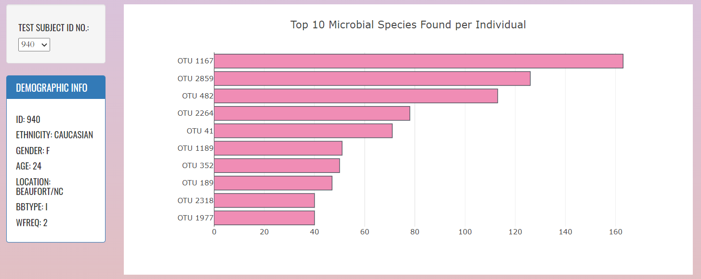
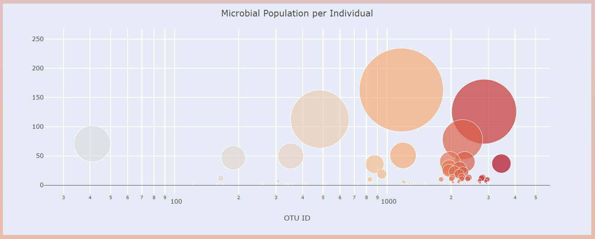

# Belly Button Diversity

## GOAL

Create an interactive dashboard to explore the [Belly Button Biodiversity dataset](http://robdunnlab.com/projects/belly-button-biodiversity/), which catalogs the microbes that colonize human navels.

## TOOLS

Plotly, JavaScript, HTML, CSS

## SUMMARY

Using the d3 library, data (in json format) was loaded and previewed.

Using JavaScript, various functions were created, namely, to:
(1) build and display the metadata;
(2) generate the bar graph and bubble chart;
(3) handle an event wherein a viewer would like to view a new sample; and
(4) initialize the dashboard.

To format the page and the contents, Plotly, HTML and CSS were utilized.

## DASHBOARD DEPLOYMENT

The dashboard can be viewed from [here](https://maylacdao.github.io/plotly-scientific-research-results-data-visualization/).

## NAVIGATING THE DASHBOARD

The landing page shows the data for the first entry in the dataset.

To view the data from other test subjects, use the drop-down menu, select your desired test subject ID number and the graphs will adjust accordingly.

### About the Data

Hulcr, J. et al.(2012) A Jungle in There: Bacteria in Belly Buttons are Highly Diverse, but Predictable. Retrieved from: http://robdunnlab.com/projects/belly-button-biodiversity/results-and-data/
